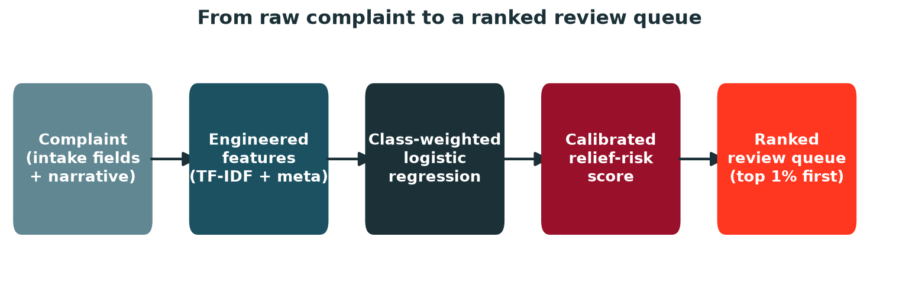
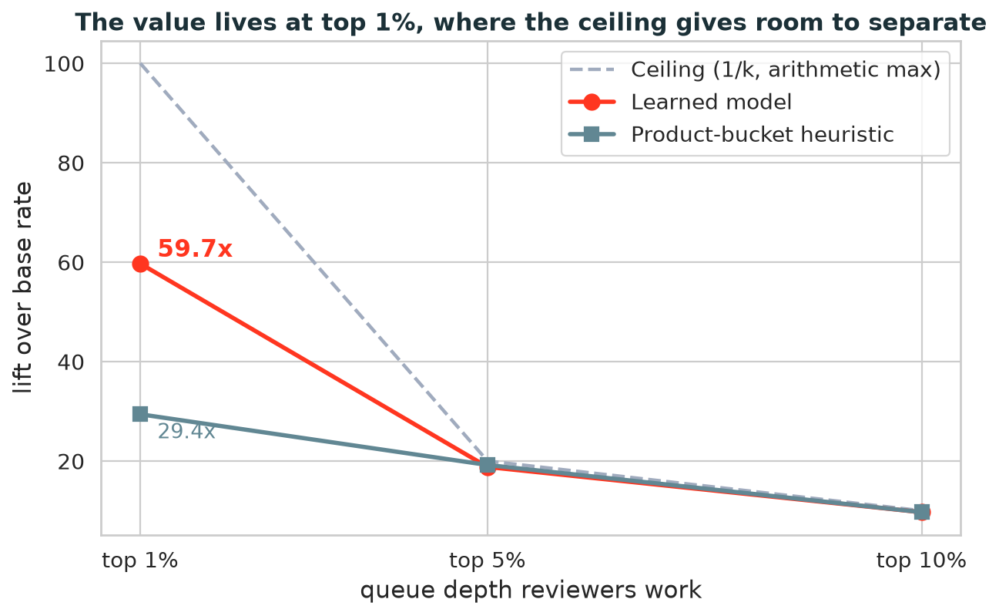

# ComplaintIQ

**ComplaintIQ** is a machine learning project for triaging consumer finance complaints using the CFPB Consumer Complaint Database.

It scores complaints for relief risk so operations and compliance teams can prioritize what reviewers look at first. Reviewers spend their hours on the cases most likely to warrant monetary relief. It's decision support, not an auto-decider.

## Documentation

* [Findings](docs/FINDINGS.md), the key results and conclusions across all notebooks, with caveats.
* [Glossary](docs/GLOSSARY.md), plain-language reference for every term and metric used in the project, with good/bad ranges for each metric.
* [Project proposal](docs/project_proposal.md), the original problem statement, plan, and evaluation design.
* [Figures](docs/figures/), result charts used throughout the docs. Regenerate them from the data with `make figures` (runs `scripts/generate_figures.py`).

## What it does

ComplaintIQ uses complaint narratives and intake-time metadata to:

* classify complaint themes
* predict monetary relief risk
* rank complaints for review
* provide interpretable signals for analysts
* optionally retrieve similar historical complaints

Example output:

```text
Complaint: "I disputed an incorrect account on my credit report..."
Predicted product: Credit reporting
Monetary relief risk: High
Recommended queue: Specialist review
```

## Dataset

This project uses the public CFPB Consumer Complaint Database.

The raw dataset can be downloaded from:

```text
https://files.consumerfinance.gov/ccdb/complaints.csv.zip
```

Main fields used include:

* `Consumer complaint narrative`
* `Product`
* `Sub-product`
* `Issue`
* `Sub-issue`
* `State`
* `Submitted via`
* `Company response to consumer`

The primary target variable is:

```text
monetary_relief = 1 if Company response to consumer == "Closed with monetary relief"
monetary_relief = 0 otherwise
```

Fields only known after complaint resolution, such as `Company response to consumer`, are used to create the target label but should not be used as input features. Using post-resolution fields as model inputs would create data leakage.

## Imbalanced Target

Only **1.28%** of complaints end in monetary relief (roughly 1 in 78 on the July 2026 snapshot). This is the key constraint downstream.

A model that always predicts “no relief” scores ~98.7% accuracy while catching zero relief cases. So accuracy won't work as a metric. Any quoted lift (e.g. “3x better than random”) is meaningless without the base rate. At 1.28%, 3x lift means something very different than at 15%. The lift math is `precision ÷ base_rate`, so the base rate is the denominator every lift number is quoted against.

## Modeling

The baseline model uses:

```text
TF-IDF + Logistic Regression
```

TF-IDF converts complaint text into numeric features by giving more weight to words and phrases that are important in a specific complaint but not common across all complaints.

Other candidate models may include:

* Linear SVM
* Random Forest
* Gradient Boosted Trees
* XGBoost or LightGBM
* Sentence embeddings with a classifier

Only 23% of complaints carry a narrative. So TF-IDF text features apply to that subset. Complaints without narratives fall back to metadata-only scoring. Both feed one ranked queue, which means they need to be on the same probability scale. That's achieved by calibration (Platt or isotonic). Otherwise a metadata-only 0.6 and a narrative-model 0.6 mean different things and the merged ranking is invalid.



## Evaluation

ComplaintIQ uses these metrics.

* **PR-AUC** (primary), precision-recall area under curve, the standard for rare-event ranking.
* **ROC-AUC** (secondary), less sensitive at the tail where relief cases live.
* **Top-k lift**, how much richer the top slice (e.g., top 5-10%) is in relief cases versus the base rate. Maps to analyst hours saved.
* **Calibration**, whether a 70% risk score actually produces ~70% relief cases. Built with Brier score or a calibration curve.

The baseline to beat isn't the raw base rate. It's the product-bucket heuristic: rank complaints by their product's historical relief rate (no ML, no training). This cheap heuristic already reaches ~9.7x lift at the top 10% (and 19.2x at top-5%, 29.4x at top-1%), measured leakage-safe on a time-split in `02_eda_supervised.ipynb` section 9a. A learned model is only useful if it clears that bar, which it does most clearly at the shallow top-1% queue (59.7x vs 29.4x).

A fixed "3x lift" number is meaningless without context. At 1.28% base rate, 3x lift means an analyst reviews ~500 complaints per week at 1 in 25 being relief (versus 1 in 78 random). That's real but modest. At 9x lift, it's 1 in 9. The heuristic already does 9x, so a learned model needs to beat 9x to matter.

The catch is that top-10% lift is capped at 10x by arithmetic (lift = precision ÷ base rate, and precision ≤ 1). Both models sit near that ceiling, so they look tied there. Read a shallower queue and the learned model separates: at the top 1% it hits **59.7x** versus the heuristic's 29.4x. See [docs/FINDINGS.md](docs/FINDINGS.md) for the full breakdown.



## Data Pipeline

The project supports two ways to work with the data.

### Option 1: Use existing Parquet data

If Parquet files already exist in `data/`, you can use them directly for modeling.

Expected files:

```text
data/complaints.parquet
data/complaints_narrative_only.parquet
```

The full Parquet file keeps all complaint rows. The narrative-only Parquet file keeps only rows where `Consumer complaint narrative` is present. It still includes the cleaned `complaint_text` column.

The narrative-only dataset is useful for faster local NLP experiments.

### Option 2: Rebuild Parquet data from the CFPB CSV

The raw CFPB data is downloaded as a compressed CSV, extracted locally, and converted into Parquet for modeling.

```text
complaints.csv.zip
 -> data/complaints.csv
 -> data/complaints.parquet
 -> model-ready features
 -> ML pipeline
```

To build the smaller narrative-filtered dataset:

```text
complaints.csv.zip
 -> data/complaints.csv
 -> data/complaints_narrative_only.parquet
 -> model-ready text features
 -> ML pipeline
```

`NARRATIVE_ONLY=1` means only rows with complaint narrative text are kept. It does not mean the narrative column is removed.

## C++ ETL Engine

ComplaintIQ includes an optional C++ ETL engine for converting the CFPB CSV into Parquet.

The C++ engine performs initial cleaning such as:

* selecting relevant CFPB fields
* renaming columns to snake_case
* trimming categorical fields
* normalizing complaint narrative text
* parsing the ISO-8601 date fields down to `date32` day values
* creating `has_narrative`
* creating `complaint_text_length`
* creating the `monetary_relief` label
* writing the cleaned dataset as Parquet

The ETL matches the current CFPB export, which is a 16-column CSV with ISO-8601
timestamp dates (for example `2025-01-26T00:45:30.000Z`). CFPB has since dropped
the `Consumer consent provided?` and `Consumer disputed?` fields, so they are no
longer part of the output schema.

The C++ ETL engine is optional. If usable Parquet files already exist in `data/`, you can start modeling without rebuilding them.

The C++ ETL engine requires:

* CMake
* a C++17 compiler
* Apache Arrow C++ with CSV support
* Apache Arrow C++ with Parquet support

The recommended cross-platform dependency setup is vcpkg. On macOS, Homebrew can also be used.

## Python Environment

The C++ ETL engine produces Parquet. Everything after that, including data exploration and modeling with TF-IDF, scikit-learn, and the other candidate models, happens in Python, primarily in Jupyter notebooks inside the Zed editor.

The Python environment is defined by `pyproject.toml` and managed with [`uv`](https://docs.astral.sh/uv/) through `make`. It is a standard virtual environment (`.venv`), so it works in any editor.

Prerequisite: install `uv`.

macOS / Linux:

```bash
# Homebrew (macOS or Linuxbrew)
brew install uv

# or the standalone installer (any macOS / Linux)
curl -LsSf https://astral.sh/uv/install.sh | sh
```

Windows (PowerShell):

```powershell
powershell -ExecutionPolicy ByPass -c "irm https://astral.sh/uv/install.ps1 | iex"
# or: winget install --id=astral-sh.uv
```

`uv` is also available via `pipx install uv` or `pip install uv` on any platform. See the [uv install docs](https://docs.astral.sh/uv/getting-started/installation/) for details.

Note: the `make` targets assume a Unix-like shell, so on Windows use WSL (or Git Bash with `make` installed). The underlying `uv` commands work natively on Windows if you prefer to run them directly.

### Create the environment

```bash
make venv
```

This creates a reproducible `.venv` (using the Python from `PYTHON_VERSION` in `config.env`, default 3.12) and installs the locked dependencies, including `ipykernel` so editors can attach a Jupyter kernel.

`make venv` installs from `requirements.txt` using `uv pip sync`. That lockfile is committed for reproducibility and is compiled from `pyproject.toml` with:

```bash
make lock
```

Run `make lock` after changing dependencies in `pyproject.toml`, then commit the updated `requirements.txt`.

### Optional dependency groups

`pyproject.toml` defines optional extras for heavier model families. Include them with `EXTRAS`:

```bash
make venv EXTRAS=boost # xgboost + lightgbm
make venv EXTRAS=imbalanced # imbalanced-learn
make venv EXTRAS="boost imbalanced" # both
```

### Cleanup

```bash
make clean CLEAN=venv # remove the virtual environment
make clean CLEAN=all # remove build artifacts, data, and the venv
```

### Working in Zed

Zed auto-detects the `.venv`. Open a notebook (there is a starter at `notebooks/01_explore.ipynb`) or use the REPL, and select the `.venv` kernel when prompted. Run cells with `ctrl-shift-enter` (or `cmd-shift-enter`).

### Other editors

The `.venv` is a standard virtualenv, so it works anywhere:

* **VS Code:** run "Python: Select Interpreter" and choose `.venv/bin/python` (VS Code auto-detects it, like Zed).
* **PyCharm:** Add Interpreter -> Existing environment -> `.venv/bin/python`.
* **JupyterLab / classic Notebook:** these discover kernels from the *global* kernel list rather than the local `.venv`. Register the kernel once, then launch Jupyter:

 ```bash
 make kernel
 ```

 This installs a "Python (ComplaintIQ)" kernelspec pointing at the `.venv`.
* **Plain terminal:**

 ```bash
 source .venv/bin/activate
 ```

### Machines behind a PyPI block (private index)

Some machines cannot reach public PyPI. To use an internal package index, copy the template and set the index URL:

```bash
cp local.mk.example local.mk
```

Then set `DATABRICKS_PYPI_PROXY` in `local.mk` to your internal index URL. The Makefile only falls back to this index when `make venv` or `make lock` runs *and* pypi.org is unreachable, so machines with normal PyPI access and external contributors are unaffected. `local.mk` is git-ignored, and the private index URL never lands in the committed `requirements.txt`.

## Databricks (Free Edition)

The notebooks and code sync to a Databricks Free Edition workspace so you can run
them on serverless compute, while the large datasets live in a Unity Catalog
volume. Three pieces work together:

* **Git folder (bi-directional editing).** A Databricks Git folder clones this
 repo into your workspace. Git is the sync medium: edit locally or in the
 Databricks UI and push/pull to keep both sides in step.
* **Asset Bundle (`databricks.yml`).** Declares the cloud resources: the Unity
 Catalog volume and a serverless job that runs the exploration notebook.
* **Unity Catalog volume.** Holds the multi-gigabyte Parquet/CSV data, which is
 far too large for Git or workspace files.

Nothing personal is committed. Your CLI profile, workspace host, and identity are
supplied at run time; only neutral project values live in `config.env`.

### Prerequisites

* The [Databricks CLI](https://docs.databricks.com/dev-tools/cli/) (v0.240 or newer).
* A CLI profile for your workspace. Create one with:

 ```bash
 databricks auth login --host https://<your-workspace>.cloud.databricks.com
 ```

* A GitHub credential linked in Databricks so the Git folder can authenticate.
 In the workspace: Settings, then Linked accounts, then Git integration. Use a
 personal access token with `repo` (write) scope so you can also push from
 Databricks.

### One-time setup

1. Point `make` at your profile (git-ignored and personal):

 ```bash
 cp local.mk.example local.mk # if you have not already
 # then set DATABRICKS_PROFILE in local.mk to your profile name
 ```

2. Create the Git folder, deploy the bundle resources, and upload the data:

 ```bash
 make db-repo-create # clone this repo into your workspace as a Git folder
 make db-deploy # create the UC volume and the serverless job
 make parquet # build data/complaints.parquet locally (if needed)
 make db-data # upload the Parquet to the UC volume
 ```

The Git-folder path (`/Users/<you>/ComplaintIQ`) and the clone URL are derived at
run time from your signed-in CLI user and your `origin` remote, so forks and
other contributors work without editing anything.

### Staying in sync

Git is the medium in both directions. One caveat: pushing *from* Databricks is a
UI action, because the Repos API cannot commit in-workspace edits. Use the Git
folder's **Commit and Push** dialog in the Databricks UI for that direction.

| Direction | How |
| --- | --- |
| Local edit to Databricks | `git push`, then `make db-pull` |
| Databricks edit to remote | **Commit and Push** in the Databricks Git dialog |
| Remote to local | `git pull` |

So a change made in the Databricks UI reaches your laptop via Commit and Push,
then `git pull`. A change made locally reaches Databricks via `git push`, then
`make db-pull`. GitHub is always in the middle.

### Data stays out of Git

The CSV (~9 GB) and Parquet (~4 GB) are git-ignored and never sync through the Git
folder. They live in the Unity Catalog volume at:

```text
/Volumes/workspace/default/complaintiq/
```

A Unity Catalog volume is FUSE-mounted at `/Volumes/...`, so read it from a
notebook with pandas directly, using the file path (no Spark required):

```python
import pandas as pd

df = pd.read_parquet("/Volumes/workspace/default/complaintiq/complaints.parquet")
```

The full Parquet is a few GB, so for lighter pandas work upload and read the
narrative-only dataset instead. Re-upload after regenerating with `make db-data`.

## Repository Structure

```text
complaintiq/
├── CMakeLists.txt
├── Makefile
├── README.md
├── LICENSE
├── config.env
├── databricks.yml            # Databricks Asset Bundle (UC volume, wheel, pipeline job)
├── local.mk.example
├── pyproject.toml            # complaintiq package + dependency groups
├── requirements.txt
├── vcpkg.json
├── data/                     # gitignored; regenerate with `make parquet`
│ ├── complaints.parquet
│ └── complaints_narrative_only.parquet
├── docs/
│ ├── FINDINGS.md             # measured results across all notebooks
│ ├── GLOSSARY.md             # term + metric reference
│ └── project_proposal.md
├── models/
│ ├── relief_pipeline.joblib  # trained demo model (narrative TF-IDF + LogReg)
│ └── demo_artifacts.json     # queue thresholds + metrics for the live demo
├── notebooks/
│ ├── 01_explore.ipynb
│ ├── 02_eda_supervised.ipynb
│ ├── 03_eda_unsupervised.ipynb
│ ├── 04a_baselines_trivial.ipynb
│ ├── 04b_baselines_logreg.ipynb
│ ├── 06_feature_plan.ipynb
│ ├── 07a_mllib_supervised.ipynb   # full 16.5M-row Spark MLlib run
│ ├── 08_unsupervised_advanced.ipynb
│ ├── 09_supervised_embeddings.ipynb
│ ├── 11_live_demo.ipynb           # interactive ipywidgets scoring demo
│ └── appendix/                    # supporting notebooks, not on the main line
│   ├── 05_baselines_unsupervised.ipynb
│   ├── 07b_mllib_unsupervised.ipynb
│   └── 10_embeddings_fullcorpus.ipynb
├── scripts/
│ └── download_cfpb_complaints.sh
├── src/
│ ├── complaintiq/             # shared Python package the notebooks import
│ │ ├── data.py               # load + chronological split helpers
│ │ ├── sampling.py           # stratified sampling
│ │ ├── features.py           # encoders, text-shape features
│ │ ├── text.py               # narrative normalization
│ │ └── metrics.py            # PR-AUC, ROC-AUC, Brier, top-k lift
│ └── etl/
│   └── csv_to_parquet.cpp    # C++ Arrow/Parquet ETL
└── test/
```

Large generated files (`data/`, the parquets, MLflow store) are gitignored. Regenerate them locally with `make parquet`, or pull them onto Databricks with the bundle's data step. The trained demo model in `models/` is small enough to track and travels with the repo so `11_live_demo` runs anywhere.

## Local Setup

### 1. Clone the repo

```bash
git clone https://github.com/R7L208/ComplaintIQ.git
cd ComplaintIQ
```

### 2. Run the core tests

```bash
make test
```

The default test suite validates the CFPB download script.

### 3. Use existing Parquet files, if available

If these files already exist, you can begin modeling directly:

```text
data/complaints.parquet
data/complaints_narrative_only.parquet
```

### 4. Download the CFPB CSV, if needed

```bash
make download_data
```

This downloads and extracts the CFPB complaint CSV into:

```text
data/complaints.csv
```

### 5. Build the optional C++ ETL engine

```bash
make build
```

This builds the `complaintiq_etl` executable using CMake.

### 6. Convert the full dataset to Parquet

```bash
make parquet
```

This writes:

```text
data/complaints.parquet
```

### 7. Convert only rows with complaint narratives

```bash
make parquet NARRATIVE_ONLY=1
```

This writes:

```text
data/complaints_narrative_only.parquet
```

## Dependency Setup

### Recommended: vcpkg

This project includes a `vcpkg.json` manifest that declares the Arrow dependency with CSV and Parquet support.

Example `vcpkg.json`:

```json
{
 "$schema": "https://raw.githubusercontent.com/microsoft/vcpkg-tool/main/docs/vcpkg.schema.json",
 "name": "complaintiq",
 "version-string": "0.1.0",
 "dependencies": [
 {
 "name": "arrow",
 "features": [
 "csv",
 "parquet"
 ]
 }
 ]
}
```

Install vcpkg:

```bash
git clone https://github.com/microsoft/vcpkg.git ~/vcpkg
cd ~/vcpkg
./bootstrap-vcpkg.sh
```

On Windows, use:

```powershell
git clone https://github.com/microsoft/vcpkg.git $env:USERPROFILE\vcpkg
cd $env:USERPROFILE\vcpkg
.\bootstrap-vcpkg.bat
```

Then from the ComplaintIQ repo:

```bash
make build
```

The Makefile looks for vcpkg at:

```text
~/vcpkg
```

To use a different vcpkg location:

```bash
make build VCPKG_ROOT=/path/to/vcpkg
```

### macOS shortcut: Homebrew

On macOS, Apache Arrow can also be installed with Homebrew:

```bash
brew install apache-arrow cmake
make build
```

## Make Targets

```bash
make test
```

Runs the download script test suite.

```bash
make download_data
```

Downloads and extracts the CFPB complaints CSV.

```bash
make build
```

Builds the optional C++ ETL engine.

```bash
make parquet
```

Creates the full Parquet dataset at `data/complaints.parquet`.

```bash
make parquet NARRATIVE_ONLY=1
```

Creates the narrative-filtered Parquet dataset at `data/complaints_narrative_only.parquet`.

```bash
make figures
```

Regenerates the result charts in `docs/figures/` from `data/complaints.parquet` (needs the Parquet built first).

```bash
make clean
```

Removes C++ build artifacts.

```bash
make clean CLEAN=data
```

Removes downloaded and generated data.

```bash
make clean CLEAN=all
```

Removes both build artifacts and data.

The Databricks sync targets (see [Databricks (Free Edition)](#databricks-free-edition)):

```bash
make db-repo-create # clone this repo into the workspace as a Git folder
make db-pull # pull the latest pushed commit into the Git folder
make db-validate # validate the asset bundle
make db-deploy # create/update the UC volume and serverless job
make db-run # run the exploration notebook as a serverless job
make db-data # upload data/complaints.parquet to the UC volume
```

## ML Workflow

The modeling workflow, implemented across the notebooks, is:

```text
cleaned Parquet
 -> chronological train/test split (80th-percentile date cut)
 -> stratified 300k sample for fast sklearn iteration
 -> engineered features (target/freq encoding, interactions, text-shape, date, TF-IDF)
 -> class-weighted logistic regression
 -> imbalance-aware evaluation (PR-AUC, top-k lift, ROC-AUC, Brier)
 -> validate at full 16.5M-row scale via Spark MLlib
 -> interpret via coefficients + the live scoring demo
```

The split is chronological (train on older complaints, test on the most recent months) so that evaluation reflects deployment on future complaints and does not leak later data into training.

**Headline result:** the engineered model reaches **59.7x lift at the top 1%** of the queue on the full 16.5M-row corpus (about 1 in 5 flagged complaints is a real relief case, versus roughly 1 in 300 at random), and the 300k-sample results hold at full scale. A separate finding is that representation choice is task-dependent: TF-IDF wins relief prediction, sentence embeddings win theme clustering. See [docs/FINDINGS.md](docs/FINDINGS.md) for the full measured results, tables, and caveats.

Candidate input features include:

* `complaint_text`
* `product`
* `sub_product`
* `issue`
* `sub_issue`
* `state`
* `submitted_via`
* `has_narrative`
* `complaint_text_length`

Target:

* `monetary_relief`

Do not use `company_response_to_consumer` or `timely_response` as input features because they are only known after the complaint has been resolved.

## Responsible Use

ComplaintIQ is a decision-support tool. It should not be used to automatically deny relief, close complaints, or reduce service quality.

Important limitations:

* CFPB complaints are not a complete view of all consumer harm.
* Complaint narratives are only available when consumers consent to publication.
* Monetary relief is an imperfect proxy for complaint severity.
* Lack of monetary relief does not mean a complaint was unimportant.
* The model may learn historical company response patterns instead of true consumer need.
* Complaint data may reflect reporting bias by geography, language, financial literacy, or awareness of the CFPB process.

Human review should remain part of any real complaint resolution workflow.

## License

This project is licensed under the Apache License 2.0.
